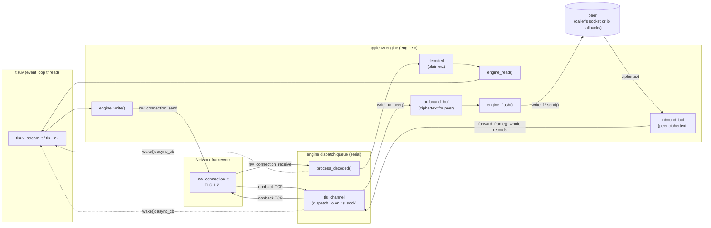
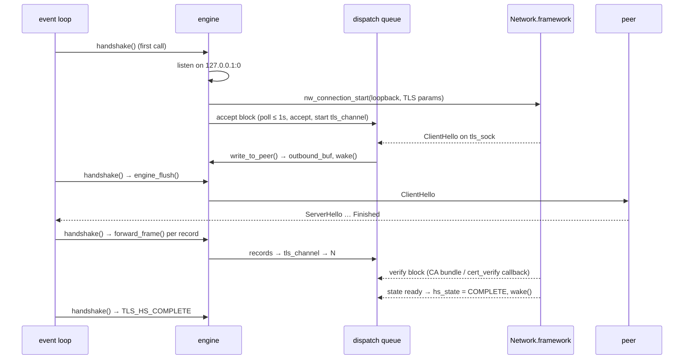

# applesec: Apple Network.framework TLS backend

`applesec` is the tlsuv TLS backend for Apple platforms, selected with
`-DTLSUV_TLSLIB=applesec` (opt-in, macOS only; `openssl` stays the default).
TLS itself is done by **Network.framework**; keys, certificates and trust
evaluation use **Security.framework**.

| File        | Contents                                                                 |
|-------------|--------------------------------------------------------------------------|
| `context.c` | `tls_context`: CA bundle, keys, certificates, client identity, FIPS status |
| `engine.c`  | `tlsuv_engine_t`: the per-connection TLS engine built on `nw_connection_t` |
| `context.h` | structures shared by the two (`struct sectransport_ctx`, key/cert types)   |

The `sectransport_*` names are historical: the backend used to be built on
SecureTransport, which was removed because it is deprecated and tops out at TLS 1.2.

## Why the engine looks the way it does

A `tlsuv_engine_t` is a TLS state machine that the caller drives over *its own*
IO: either a socket it owns (`set_io_fd`, used by `tlsuv_stream_t`) or a pair of
read/write callbacks (`set_io`, used by `tls_link`). Network.framework does not
offer that: an `nw_connection_t` owns its transport, and a custom
`nw_framer` cannot replace the transport underneath TLS.

So the engine points Network.framework at a **private loopback TCP connection**
and relays ciphertext between that connection and the caller's IO:

- `engine_handshake()` (first call) binds a listener on `127.0.0.1:0`, creates an
  `nw_connection_t` to it with TLS parameters for the real server name, and
  accepts the loopback connection (`tls_sock`) on the engine's dispatch queue.
- Everything Network.framework writes to `tls_sock` is ciphertext for the peer:
  it is read by a `dispatch_io` channel (`tls_channel`), buffered in
  `outbound_buf`, and written to the caller's IO by `engine_flush()`.
- Ciphertext from the peer is split into TLS records (`read_inbound_frame()`) and
  each complete record is written into `tls_channel` (`forward_frame()`), where
  Network.framework decrypts it.
- The application talks to the `nw_connection_t` directly:
  `engine_write()` → `nw_connection_send()`, and decrypted data arrives through
  `nw_connection_receive()` into the `decoded` buffer (`process_decoded()`), from
  which `engine_read()` copies.

## Threading and wakeups

Two threads touch an engine:

- the **event loop thread**, which calls the vtable (`handshake`, `read`,
  `write`, `close`, `free`) and does all IO on the caller's socket/callbacks;
- the engine's **serial dispatch queue** (`e->queue`), on which all
  Network.framework handlers, the `dispatch_io` handlers and the accept block run.

Rules the code relies on:

- `tls_channel` is created by the accept block on the queue, and every other use
  of it is also dispatched to the queue. The accept block is enqueued first, so
  anything queued after it sees the channel in its final state (or `NULL` if the
  accept failed).
- The caller's socket (`e->sock`) is only used on the loop thread
  (`engine_flush()`, `engine_socket_read()`), and in `stop_io()`, which runs while
  the loop thread is blocked in `dispatch_sync`.
- `decoded`/`decoded_len`/`error` are guarded by `decode_mutex`;
  `outbound_buf`/`outbound_len`/`shutdown_pending` by `outbound_mutex`.
  `decoded_len`, `outbound_len` and `hs_state` are atomics so that `wake()` and
  the loop thread can read them without taking the other lock.

Because Network.framework produces data on its own schedule, the engine is
**asynchronous**: it implements the optional `setup_async` vtable method. The
owner registers a callback that the engine calls (from the queue, or from
`engine_flush()` on the loop thread) whenever there is new plaintext, new
ciphertext to send, a handshake state change or an error. The callback must be
thread safe; both owners just post a `uv_async_t`:

- `tlsuv_stream_t` (`src/tlsuv.c`) reruns `on_clt_io()`: the handshake while
  connecting, reads, and flushes (it polls `UV_WRITABLE` while the engine still
  has buffered ciphertext);
- `tls_link` (`src/tls_link.c`) reruns its handshake or read path and pushes
  `ssl_out` to its parent link.

`engine_setup_async()` swaps the callback with `dispatch_sync` on the queue, so
once it returns (including with `NULL` to detach) the old callback is never
called again.

## Handshake

A failure anywhere (connection error, rejected certificate, accept timeout)
goes through `handshake_failed()`, which records the error, sets
`TLS_HS_ERROR` and wakes the owner so the connect callback reports it.

`engine_socket_write()` treats `ENOTCONN`/`EINPROGRESS`/`EALREADY` as
"try again": `tlsuv_stream_connect_addr()` hands the engine a socket whose
non-blocking `connect()` may still be in progress.

## Server certificate verification

Set up in `applenw_new_engine()` with `sec_protocol_options_set_verify_block`:

- **`cert_verify` callback set** (`tls_set_cert_verify`): the peer chain is
  handed to the callback, which alone decides, as in the other backends.
- **CA bundle set**: `SecTrust` with the SSL server policy for the host name plus
  the basic X.509 policy, anchored to the bundle only
  (`SecTrustSetAnchorCertificatesOnly`). Apple's SSL policy also caps server
  certificate lifetime (825 days) even for private CAs, which Ziti controller
  certificates exceed. If evaluation fails and the **only** failed check is that
  cap (`OtherTrustValidityPeriod`, see `only_validity_cap_failed()`), the
  certificate is accepted; host name, EKU, key size, expiry etc. are still
  enforced. The trust result keys are not public API, so anything unrecognised
  counts as a failure.
- **neither**: Network.framework's default evaluation against the system trust store.

Minimum protocol version is TLS 1.2; ALPN is set with `set_protocols`, and the
negotiated protocol is copied into the engine (`engine_get_alpn`).

## Keys, certificates and the client identity (`context.c`)

- **PEM input**: `load_ca`, `load_cert` and `load_key` accept PEM/DER or a file
  path. A length that counts the terminating NUL (as mbedTLS requires) is
  accepted: `pem_trimmed_len()` drops trailing NULs, which `SecItemImport`
  rejects.
- **Keys** are `SecKeyRef`s (EC and RSA), created with `SecKeyCreateWithData`;
  the original PEM is kept so `to_pem()` round-trips.
- **Client identity**: TLS needs a `SecIdentityRef`, and the only public way to
  make one is `SecIdentityCreateWithCertificate`, which pairs a certificate with
  a key *stored in a keychain*. `make_identity()` therefore imports the key and
  leaf certificate into a per-context temporary file keychain in `$TMPDIR`
  (random passphrase, deleted with the context). The keychain's auto-lock is
  disabled and it is unlocked before each import, so a later `set_own_cert`
  (e.g. certificate renewal) works after the machine sleeps; re-importing a key
  that is already there is not an error. `ssl_chain` holds
  `[identity, intermediates…]`, which `new_client_identity()` in `engine.c`
  turns into a `sec_identity_t`.
- **FIPS**: `fips_status` reports `TLS_FIPS_ENABLED` ("Apple corecrypto"), since
  corecrypto always runs in FIPS mode and has no switch or query API.

## Teardown

- `engine_close()`/`engine_free()` call `stop_io()`: with `dispatch_sync` on the
  queue it clears the async callback, stops and releases `tls_channel` and closes
  the caller's socket. It may wait up to 1s if the accept block is still polling.
- `engine_free()` cancels the `nw_connection_t`. Network.framework delivers the
  `cancelled` state later, on the queue; whichever of `engine_free()` and
  `cancelled` happens second deallocates the engine (`freed`/`conn_cancelled`
  flags), so neither the owner nor pending handlers touch freed memory.
- A failed `nw_connection_send` records the error and wakes the owner instead of
  cancelling the connection; the stream then sees `TLS_ERR`.

## Limitations

- **macOS only.** `SecItemImport`, `SecIdentityCreateWithCertificate` and file
  keychains are unavailable on iOS; `context.c` would need a keychain-free
  key/certificate layer (e.g. data-protection keychain items + `kSecClassIdentity`)
  to run there. `engine.c` uses only APIs that exist on iOS.
- Not implemented: server engines (`new_server_engine`), `get_peer_cert`,
  `allow_partial_chain`, CSR generation, PKCS#11 and platform keychain keys
  (keys must be extractable to go into the temporary keychain).
- `engine_reset()` only resets the handshake state; it does not tear down the
  `nw_connection_t`, so an engine cannot be reused for a new handshake.
- Plaintext written with `engine_write()` is buffered by Network.framework;
  backpressure comes from `engine_write()` returning `TLS_AGAIN` while previous
  ciphertext is still unflushed, so roughly one write's worth is in flight.
- Each connection costs a loopback TCP connection and a dispatch queue.

## Tests

The regular suites run against this backend (`all_tests` built with
`TLSUV_TLSLIB=applesec`). Backend-specific coverage includes
`stream ALPN negotiation`, `load multi-cert PEM with and without NUL`,
`set_own_cert repeatedly on one context` and `https over custom src`
(the `tls_link` path).
