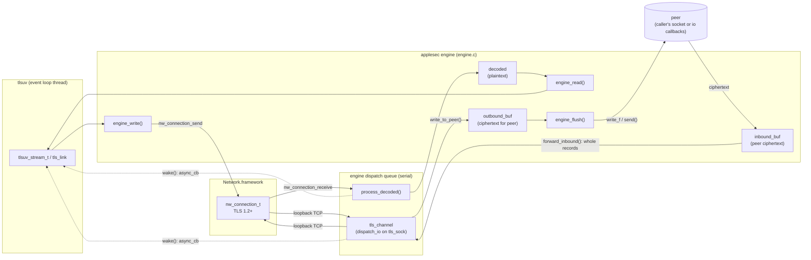
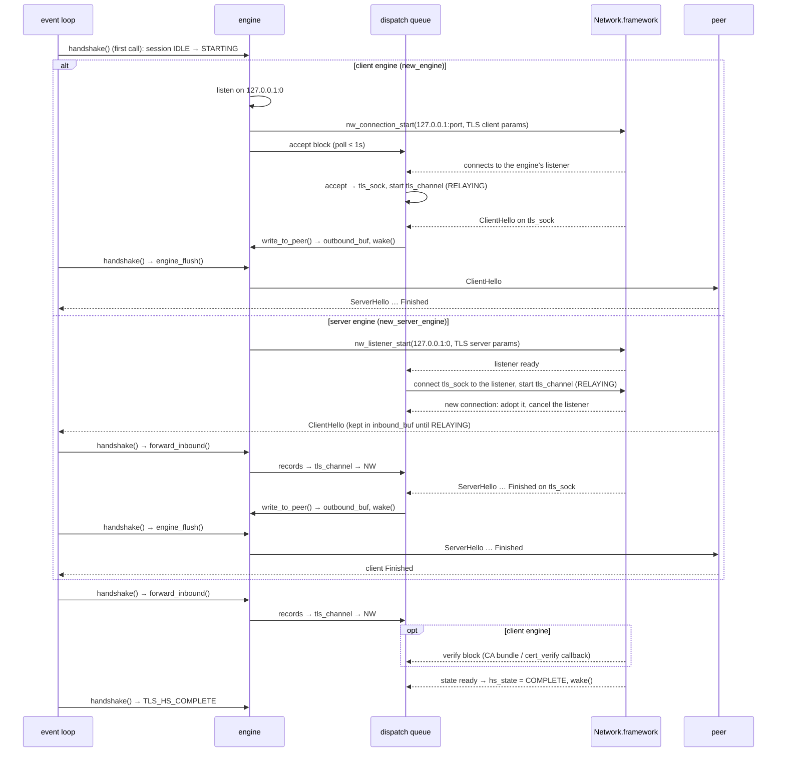

# applesec: Apple Network.framework TLS backend

`applesec` is the tlsuv TLS backend for Apple platforms, selected with
`-DTLSUV_TLSLIB=applesec` (opt-in, macOS only; `openssl` stays the default).
TLS itself is done by **Network.framework**; keys, certificates and trust
evaluation use **Security.framework**.

| File        | Contents                                                                 |
|-------------|--------------------------------------------------------------------------|
| `context.c` | `tls_context`: CA bundle, keys, certificates, client identity, FIPS status |
| `engine.c`  | `tlsuv_engine_t`: client and server TLS engines built on `nw_connection_t` / `nw_listener_t` |
| `context.h` | structures shared by the two (`struct applesec_ctx`, key/cert types)   |

## Why the engine looks the way it does

A `tlsuv_engine_t` is a TLS state machine that the caller drives over *its own*
IO: either a socket it owns (`set_io_fd`, used by `tlsuv_stream_t`) or a pair of
read/write callbacks (`set_io`, used by `tls_link`). Network.framework does not
offer that: an `nw_connection_t` owns its transport, and a custom
`nw_framer` cannot replace the transport underneath TLS.

So the engine points Network.framework at a **private loopback TCP connection**
and relays ciphertext between that connection and the caller's IO:

- On the first `engine_handshake()`, `engine_create_client()` binds a listener on
  `127.0.0.1:0`, creates an `nw_connection_t` to it with TLS parameters for the
  real server name, and accepts the loopback connection (`tls_sock`) on the
  engine's dispatch queue. (Server engines do the reverse, see Server engines.)
- Everything Network.framework writes to `tls_sock` is ciphertext for the peer:
  it is read by a `dispatch_io` channel (`tls_channel`), buffered in
  `outbound_buf`, and written to the caller's IO by `engine_flush()`.
- Ciphertext from the peer is split into TLS records (`read_inbound_record()`) and
  each complete record is written into `tls_channel` (`forward_inbound()`), where
  Network.framework decrypts it.
- The application talks to the `nw_connection_t` directly:
  `engine_write()` → `nw_connection_send()`, and decrypted data arrives through
  `nw_connection_receive()` into the `decoded` buffer (`process_decoded()`), from
  which `engine_read()` copies.

```mermaid
flowchart LR
    subgraph app["tlsuv (event loop thread)"]
        S["tlsuv_stream_t / tls_link"]
    end

    subgraph eng["applesec engine (engine.c)"]
        R["engine_read()"]
        W["engine_write()"]
        F["engine_flush()"]
        IN["inbound_buf<br/>(peer ciphertext)"]
        OUT["outbound_buf<br/>(ciphertext for peer)"]
        DEC["decoded<br/>(plaintext)"]
    end

    subgraph q["engine dispatch queue (serial)"]
        CH["tls_channel<br/>(dispatch_io on tls_sock)"]
        PD["process_decoded()"]
    end

    subgraph nw["Network.framework"]
        NWC["nw_connection_t<br/>TLS 1.2+"]
    end

    PEER[("peer<br/>(caller's socket or io callbacks)")]

    PEER -- "ciphertext" --> IN
    IN -- "forward_inbound(): whole records" --> CH
    CH -- "loopback TCP" --> NWC
    NWC -- "nw_connection_receive" --> PD --> DEC --> R --> S
    S --> W -- "nw_connection_send" --> NWC
    NWC -- "loopback TCP" --> CH
    CH -- "write_to_peer()" --> OUT --> F -- "write_f / send()" --> PEER
    PD -. "wake(): async_cb" .-> S
    CH -. "wake(): async_cb" .-> S
```

## Threading and wakeups

Two threads touch an engine:

- the **event loop thread**, which calls the vtable (`handshake`, `read`,
  `write`, `close`, `free`) and does all IO on the caller's socket/callbacks;
- the engine's **serial dispatch queue** (`e->queue`), on which all
  Network.framework handlers, the `dispatch_io` handlers and the accept block run.

Rules the code relies on:

- `tls_channel` is created on the queue (by the client's accept block or the
  server's listener-ready handler, in `tls_to_socket()`, which also moves the
  session to `SESSION_RELAYING`), and every other use of it is dispatched to the
  queue too. `engine_handshake()` forwards peer ciphertext only once the session
  is `RELAYING`, so records are never handed to a channel that does not exist yet.
- The caller's socket (`e->sock`) is used on the loop thread (`engine_flush()`,
  `engine_socket_read()`) while the owner drives the engine; after `close()`/`free()`
  the owner no longer does, and the queue takes over: it flushes close_notify and
  `stop_io()` closes the socket there.
- `decoded`/`decoded_len`/`error` are guarded by `decode_mutex`;
  `outbound_buf`/`outbound_len`/`shutdown_pending` by `outbound_mutex`.
  `decoded_len`, `outbound_len`, `hs_state` and `session` are atomics so that
  `wake()` and the loop thread can read them without taking the other lock;
  `async_cb`/`async_ctx` are guarded by `async_mutex`.

Because Network.framework produces data on its own schedule, the engine is
**asynchronous**: it implements the optional `setup_async` vtable method. The
owner registers a callback that the engine calls (from the queue, or from
`engine_flush()` on the loop thread) whenever there is new plaintext, new
ciphertext to send, a handshake state change or an error. The callback must be
thread safe; both owners just post a `uv_async_t`:

- `tlsuv_stream_t` (`src/tlsuv.c`) reruns `on_clt_io()`: the handshake while
  connecting, reads, and flushes (it polls `UV_WRITABLE` while the engine still
  has buffered ciphertext);
- `tls_link` (`src/tls_link.c`) reruns its handshake or read path and pushes
  `ssl_out` to its parent link.

`engine_setup_async()` swaps the callback under `async_mutex`, which `wake()` holds
while calling it, so once it returns (including with `NULL` to detach) the old
callback is never called again; it only waits for a wakeup in progress, never for
the queue.

## Handshake

```mermaid
sequenceDiagram
    participant L as event loop
    participant E as engine
    participant Q as dispatch queue
    participant N as Network.framework
    participant P as peer

    L->>E: handshake() (first call): session IDLE → STARTING
    alt client engine (new_engine)
        E->>E: listen on 127.0.0.1:0
        E->>N: nw_connection_start(127.0.0.1:port, TLS client params)
        E->>Q: accept block (poll ≤ 1s)
        N-->>Q: connects to the engine's listener
        Q->>Q: accept → tls_sock, start tls_channel (RELAYING)
        N-->>Q: ClientHello on tls_sock
        Q->>E: write_to_peer() → outbound_buf, wake()
        L->>E: handshake() → engine_flush()
        E->>P: ClientHello
        P-->>L: ServerHello … Finished
    else server engine (new_server_engine)
        E->>N: nw_listener_start(127.0.0.1:0, TLS server params)
        N-->>Q: listener ready
        Q->>N: connect tls_sock to the listener, start tls_channel (RELAYING)
        N-->>Q: new connection: adopt it, cancel the listener
        P-->>L: ClientHello (kept in inbound_buf until RELAYING)
        L->>E: handshake() → forward_inbound()
        E->>Q: records → tls_channel → NW
        N-->>Q: ServerHello … Finished on tls_sock
        Q->>E: write_to_peer() → outbound_buf, wake()
        L->>E: handshake() → engine_flush()
        E->>P: ServerHello … Finished
        P-->>L: client Finished
    end
    L->>E: handshake() → forward_inbound()
    E->>Q: records → tls_channel → NW
    opt client engine
        N-->>Q: verify block (CA bundle / cert_verify callback)
    end
    N-->>Q: state ready → hs_state = COMPLETE, wake()
    L->>E: handshake() → TLS_HS_COMPLETE
```

The client relay is NW connecting to the engine's own loopback listener; the server
relay is the mirror image, the engine connecting to NW's TLS listener. Either way
peer ciphertext is only forwarded once the relay exists (`SESSION_RELAYING`), and
from then on both sides move records the same way.

A failure anywhere (connection error, rejected certificate, accept timeout,
listener failure) goes through `handshake_failed()`, which records the error, sets
`TLS_HS_ERROR` and wakes the owner so the connect callback reports it.

`engine_socket_write()` treats `ENOTCONN`/`EINPROGRESS`/`EALREADY` as
"try again": `tlsuv_stream_connect_addr()` hands the engine a socket whose
non-blocking `connect()` may still be in progress.

## Server certificate verification

Set up in `applesec_new_engine()` with `sec_protocol_options_set_verify_block`:

- **`cert_verify` callback set** (`tls_set_cert_verify`): the peer chain is
  handed to the callback, which alone decides, as in the other backends.
- **CA bundle set**: `SecTrust` with the SSL server policy for the host name plus
  the basic X.509 policy, anchored to the bundle only
  (`SecTrustSetAnchorCertificatesOnly`). Apple's SSL policy also caps server
  certificate lifetime (825 days) even for private CAs, which Ziti controller
  certificates exceed. If evaluation fails and the **only** failed check is that
  cap (`OtherTrustValidityPeriod`, see `only_validity_cap_failed()`), the
  certificate is accepted; host name, EKU, key size, expiry etc. are still
  enforced. The trust result keys are not public API, so anything unrecognised
  counts as a failure.
- **neither**: Network.framework's default evaluation against the system trust store.

Minimum protocol version is TLS 1.2; ALPN is set with `set_protocols`, and the
negotiated protocol is copied into the engine (`engine_get_alpn`; `""` after a
handshake that negotiated none, `NULL` before the handshake completes). After the
handshake, `get_peer_cert` returns the chain the server sent (leaf first), read
from the connection's TLS metadata.

## Server engines

`new_server_engine` (`applesec_new_server_engine()`) needs the context's own
certificate (`set_own_cert`), which becomes the server's `sec_identity_t`. The relay
is the mirror image of the client's: on the first `handshake()`,
`engine_create_server()` starts a TLS `nw_listener_t` on `127.0.0.1:0`, and once it
is ready the engine connects a plain TCP socket to it (`tls_sock`). The peer's
ciphertext is relayed over that socket exactly as for a client, and the connection
the listener accepts is the TLS session; the listener is cancelled after that one
connection. `engine_handshake()` holds peer ciphertext back until the relay exists
(`SESSION_RELAYING`), so an early ClientHello is not dropped.

- **No client certificates.** Network.framework only offers a *required* client
  certificate publicly (`sec_protocol_options_set_peer_authentication_required`);
  the optional mode is marked unavailable in the SDK, and requiring one would
  reject clients that have none. The server therefore never sends a
  CertificateRequest, `set_cert_verify` is not used for clients, and the server's
  `get_peer_cert` returns `TLS_ERR`.
- **ALPN**: the server's own order wins. A client whose protocols do not overlap
  with the server's fails the handshake (Network.framework sends
  `no_application_protocol`), as with Schannel; OpenSSL completes without one.
- `engine_close()` sends close_notify on both sides (see Teardown).

## Keys, certificates and the client identity (`context.c`)

- **PEM input**: `load_ca`, `load_cert` and `load_key` accept PEM/DER or a file
  path. A length that counts the terminating NUL (as mbedTLS requires) is
  accepted: `pem_trimmed_len()` drops trailing NULs, which `SecItemImport`
  rejects.
- **Keys** are `SecKeyRef`s (EC and RSA), created with `SecKeyCreateWithData`;
  the original PEM is kept so `to_pem()` round-trips.
- **Client identity**: TLS needs a `SecIdentityRef`, and the only public way to
  make one is `SecIdentityCreateWithCertificate`, which pairs a certificate with
  a key *stored in a keychain*. `make_identity()` therefore imports the key and
  leaf certificate into a per-context temporary file keychain in `$TMPDIR`
  (random passphrase, deleted with the context). The keychain's auto-lock is
  disabled and it is unlocked before each import, so a later `set_own_cert`
  (e.g. certificate renewal) works after the machine sleeps; re-importing a key
  that is already there is not an error. `ssl_chain` holds
  `[identity, intermediates…]`, which `new_client_identity()` in `engine.c`
  turns into a `sec_identity_t`.
- **FIPS**: `fips_status` reports `TLS_FIPS_ENABLED` ("Apple corecrypto"), since
  corecrypto always runs in FIPS mode and has no switch or query API.

## Teardown

- **`engine_close()`/`engine_free()` do not block.** They detach the owner's async
  callback (under `async_mutex`) and move the rest to the queue: `stop_io()` stops
  and releases `tls_channel` (and a server's listener) and closes the caller's
  socket there.
- **close_notify.** NW only emits it on a graceful `nw_connection_cancel` (a final
  send does not), and asynchronously. On a completed connection over a socket,
  `engine_close()` cancels gracefully; the relay's read handler flushes the alert to
  the socket from the queue, and IO stops once NW is done, or after 200 ms. With
  `set_io` the io callbacks belong to the owner and are not thread safe, so the
  queue cannot flush and close_notify is not sent.
- **Reference counted.** Network.framework may run a callback it has already
  picked up even after its handler is replaced, so the engine is kept alive by
  references (`refs`): the owner's, one per `nw_connection_t` and `nw_listener_t`
  (dropped by its `cancelled` state, the last callback), one for the client's
  accept block, one for `tls_channel` (dropped by the `dispatch_io` cleanup
  handler, which runs after all its read handlers), and those of a pending
  `engine_close()` and its 200 ms timer. `engine_free()` marks the session closed
  (unless a graceful close is still flushing), cancels the connection and drops the
  owner's reference; the last reference deallocates the engine and releases the CA,
  identity, parameters and dispatch queue.
- **Session state.** Each connection's lifecycle is one `session` value:
  `IDLE → STARTING → RELAYING → CLOSING → CLOSED`; a non-graceful close or
  `engine_free()` goes straight to `CLOSED` from any state, and `engine_reset()`
  goes back to `IDLE`. Callbacks check `is_current()` (same `conn_gen`, not
  `CLOSED`); those from a replaced or closed session return without doing
  anything except dropping their reference.
- A failed `nw_connection_send` records the error and wakes the owner instead of
  cancelling the connection; the stream then sees `TLS_ERR`.
- `engine_reset()` detaches the current connection (and a server's listener) on the
  queue, bumps `conn_gen` so its late events are ignored, stops `tls_channel`,
  cancels the connection and clears all per-session state, so the next
  `engine_handshake()` starts over; `set_io_fd` can then hand over a new socket.
  Unlike close/free it uses `dispatch_sync`, so it can block for up to 1 s behind a
  client accept block that is still polling.

## Limitations

- **macOS only.** `SecItemImport`, `SecIdentityCreateWithCertificate` and file
  keychains are unavailable on iOS; `context.c` would need a keychain-free
  key/certificate layer (e.g. data-protection keychain items + `kSecClassIdentity`)
  to run there. `engine.c` uses only APIs that exist on iOS.
- Not implemented: client certificates on server engines (see above),
  `allow_partial_chain`, CSR generation, PKCS#11 and platform keychain keys
  (keys must be extractable to go into the temporary keychain).
- Backpressure: Network.framework encrypts asynchronously, so `engine_write()`
  bounds plaintext not yet sent by NW plus ciphertext not yet flushed to the peer
  (`NW_WRITE_LIMIT`, 256 KiB). Beyond that it accepts a partial write or returns
  `TLS_AGAIN`, and wakes the owner once half the window is free. For such async
  engines `tlsuv_stream_t` does not poll `UV_WRITABLE` for queued writes (the
  socket is writable while the engine is full); it retries on the wakeup.
- `engine_reset()` blocks (see Teardown); close/free do not.
- Each connection costs a loopback TCP connection and a dispatch queue.

## Tests

The regular suites run against this backend (`all_tests` built with
`TLSUV_TLSLIB=applesec`). Backend-specific coverage includes
`stream ALPN negotiation`, `stream peer certificate`,
`load multi-cert PEM with and without NUL`,
`set_own_cert repeatedly on one context`, `engine reset and reuse` and
`https over custom src` (the `tls_link` path); the `[server]` tests run with
applesec on both sides. Test drivers that call engines in a loop must give an
async engine time between calls and flush a sender with `write(e, NULL, 0)`.
